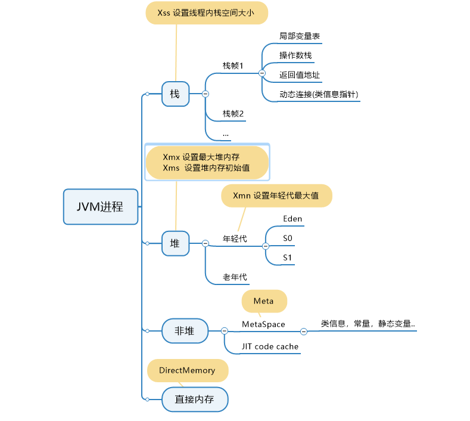

### 1,字节码分析
 Hello.java   HelloBytecode.md
 
### 2， 自定义类加载器
CustomClassLoader

### 3  画一张图，展示 Xmx、Xms、Xmn、Meta、DirectMemory、Xss 这些内存参数的关系

### 4 检查一下自己维护的业务系统的 JVM 参数配置，用 jstat 和 jstack、jmap 查看一下详情，并且自己独立分析一下大概情况，思考有没有不合理的地方，如何改进

### 5. 本机使用 G1 GC 启动一个程序，仿照课上案例分析一下 JVM 情况

